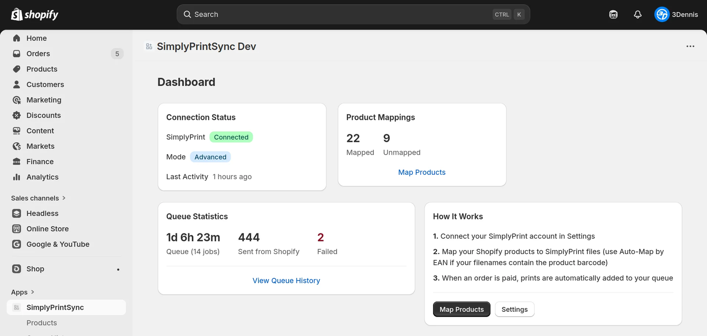
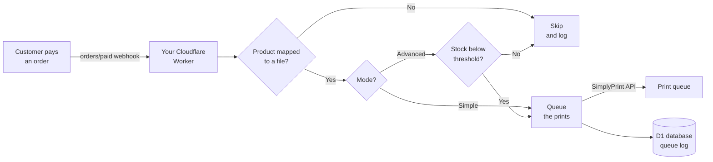
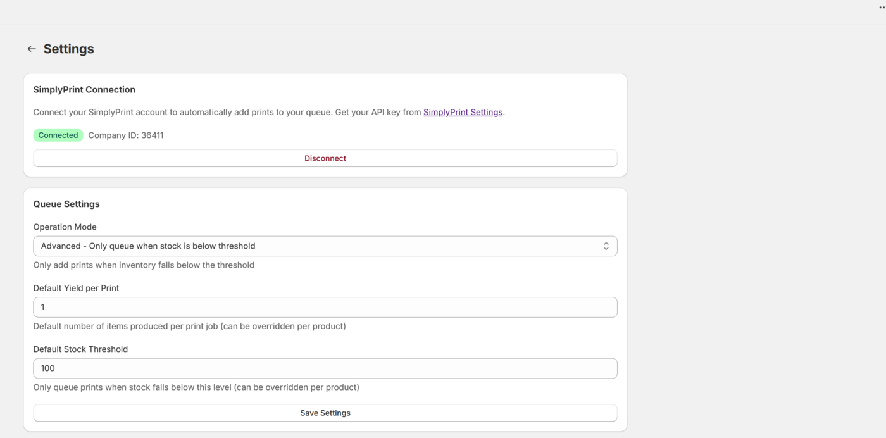
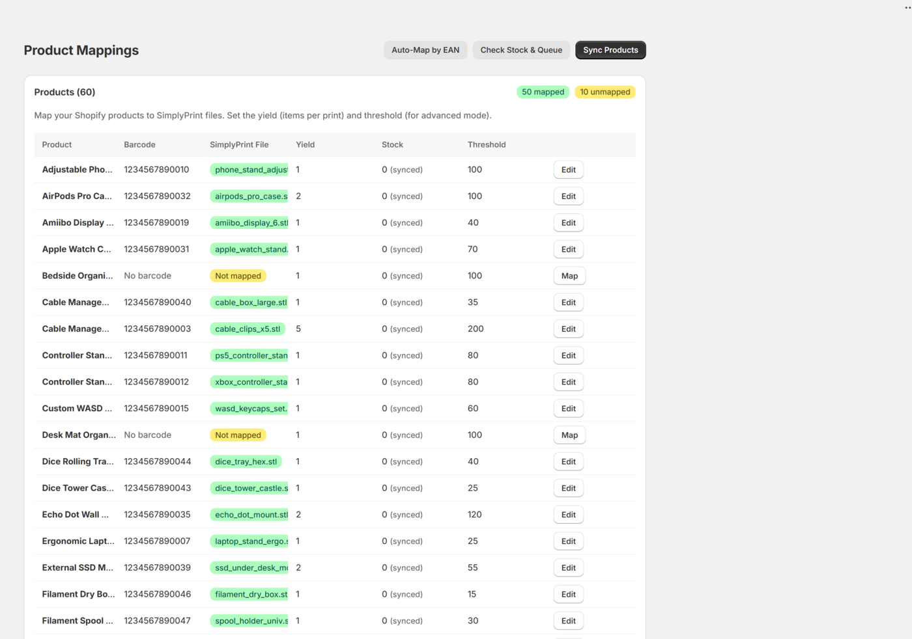
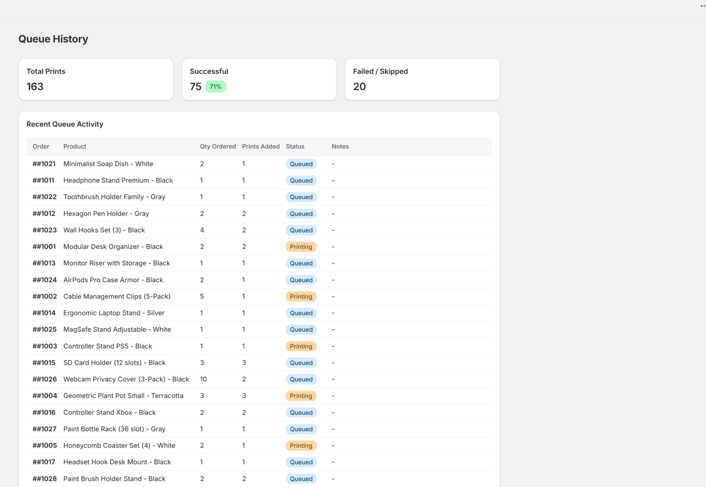
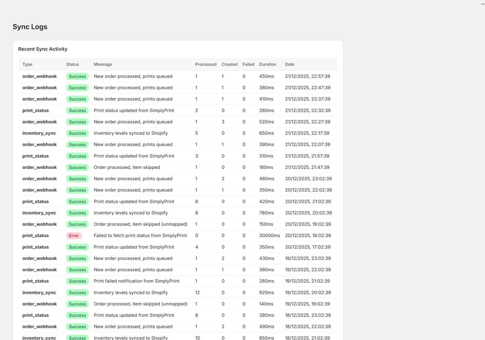

# Shopify2SimplyPrint

**Automatically add 3D print jobs to your [SimplyPrint](https://simplyprint.io) queue when a Shopify order is paid.**

Self-hosted on [Cloudflare Workers](https://workers.cloudflare.com/). Free to run on Cloudflare's free tier for typical shop volumes.

[](LICENSE)

> **Unofficial project.** Not affiliated with, endorsed by, or supported by SimplyPrint or Shopify. "SimplyPrint" and "Shopify" are trademarks of their respective owners.



---

## Contents

- [What it does](#what-it-does)
- [How it works](#how-it-works)
- [Before you start](#before-you-start)
- [Deploy to Cloudflare](#deploy-to-cloudflare)
- [Connect your store](#connect-your-store)
- [Operation modes](#operation-modes)
- [Product mapping](#product-mapping)
- [Configuration reference](#configuration-reference)
- [Local development](#local-development)
- [Troubleshooting](#troubleshooting)
- [Known limitations](#known-limitations)
- [Contributing](#contributing)
- [License](#license)

---

## What it does

If you sell 3D-printed products on Shopify and print them with SimplyPrint, this closes the loop between the two:

- **Orders become print jobs.** When an order is paid, the matching SimplyPrint files are added to your print queue automatically.
- **Print only what you need.** In advanced mode it checks your Shopify stock first and only queues when you are actually running low.
- **One product, many files.** A product assembled from several printed parts maps to several SimplyPrint files, each with its own quantity.
- **Bulk mapping by barcode.** Auto-map products to files by matching the EAN in the filename to the product's barcode.
- **Full history.** Every queued job and every sync is logged and browsable in the app.

## How it works



Everything runs in your own Cloudflare account. Your Shopify and SimplyPrint credentials stay in your own Worker and your own D1 database. The SimplyPrint API key is encrypted at rest.

## Before you start

You need four things:

| | |
|---|---|
| **A Cloudflare account** | Free tier is fine. [Sign up](https://dash.cloudflare.com/sign-up) |
| **A Shopify store** | Plus a [Shopify Partner account](https://partners.shopify.com/) to create the app |
| **A SimplyPrint account** | With files uploaded and an API key |
| **~15 minutes** | Most of it waiting for deploys |

> **Note on ordering.** Shopify needs to know your app's URL, and your app's URL only exists after you deploy. So the flow is: create the Shopify app with a placeholder URL → deploy → come back and fill in the real URL. That back-and-forth is unavoidable; the steps below walk through it.

## Deploy to Cloudflare

### Step 1: Create the Shopify app

1. Go to your [Shopify Partner Dashboard](https://partners.shopify.com/) → **Apps** → **Create app** → **Create app manually**.
2. Name it whatever you like (for example `Shopify2SimplyPrint`). This is the name merchants see in their Shopify admin.
3. Open the app → **Overview** → **Client credentials**. Copy the **Client ID** and **Client secret**. You need both in the next step.

Leave this tab open; you will come back to it in step 3.

### Step 2: Deploy the Worker

Click the button:

[](https://deploy.workers.cloudflare.com/?url=https://github.com/dennisklappe/Shopify2SimplyPrint)

Cloudflare will fork the repo to your GitHub account, then ask you to fill in four fields:

| Field | Value |
|---|---|
| `SHOPIFY_API_KEY` | The **Client ID** from step 1 |
| `SHOPIFY_API_SECRET` | The **Client secret** from step 1 |
| `ENCRYPTION_KEY` | A random 32-character string. Generate one with `openssl rand -hex 16` |
| `SHOPIFY_APP_URL` | Enter `https://example.com` for now, see the note below |

The D1 database is created and bound for you automatically.

> **Why the placeholder URL?** `SHOPIFY_APP_URL` has to be the address of this Worker, which does not exist until the deploy finishes. So you put anything valid there now and correct it in step 3. All four fields appear masked on that screen, including the two that are not actually secrets.

When the deploy finishes, Cloudflare shows your real Worker URL, something like
`https://shopify2simplyprint.your-subdomain.workers.dev`. **Copy it.**

<details>
<summary><strong>Prefer to deploy manually?</strong></summary>

```bash
git clone https://github.com/dennisklappe/Shopify2SimplyPrint.git
cd Shopify2SimplyPrint
npm install

# Create the database and copy the returned database_id into wrangler.toml
npx wrangler d1 create shopify2simplyprint

# Apply the schema
npm run db:migrate:remote

# Set your secrets
npx wrangler secret put SHOPIFY_API_SECRET
npx wrangler secret put ENCRYPTION_KEY

npm run deploy
```

Then set `SHOPIFY_API_KEY` and `SHOPIFY_APP_URL` in the `[vars]` block of `wrangler.toml` and deploy once more.

</details>

### Step 3: Point Shopify at your Worker

Back in the Shopify Partner Dashboard, open your app's **Configuration** and set:

- **App URL** → your Worker URL
- **Allowed redirection URLs** → add all three:
  - `https://YOUR-WORKER-URL/auth/callback`
  - `https://YOUR-WORKER-URL/auth/shopify/callback`
  - `https://YOUR-WORKER-URL/api/auth/callback`

Then tell the Worker about itself. In the Cloudflare dashboard, open your Worker → **Settings** → **Variables and Secrets**, and set:

| Variable | Value |
|---|---|
| `SHOPIFY_APP_URL` | Your Worker URL |
| `SHOPIFY_API_KEY` | The **Client ID** from step 1 |

Save, and redeploy the Worker so the new values take effect.

### Step 4: Apply the database schema

If you used the Deploy button, apply the schema once:

```bash
npx wrangler d1 execute shopify2simplyprint --remote --file=./migrations/0001_initial.sql
```

### Step 5: Install it on your store

From the Partner Dashboard, choose **Test on development store** (or **Select store** for a live store) and install. The app appears in your Shopify admin under **Apps**.

## Connect your store

Open the app in Shopify and go to **Settings**:



1. Get your API key from [SimplyPrint → User Settings → API](https://simplyprint.io/panel/user_settings/api).
2. Paste the API key and your Company ID, then save. The app verifies the connection before storing anything, and encrypts the API key with your `ENCRYPTION_KEY`.
3. Pick your operation mode and defaults (see below).

Then go to **Products** → **Sync Products** to import your Shopify catalogue, and map products to SimplyPrint files.

## Operation modes

**Simple mode**: every paid order queues prints.

```
prints_to_queue = ceil(quantity_ordered / yield_per_print)
```

**Advanced mode**: checks Shopify stock first and only queues when you are below your threshold. This lets you adjust stock by hand without triggering unnecessary prints.

```
if current_stock < threshold:
    deficit         = threshold - current_stock + quantity_ordered
    prints_to_queue = ceil(deficit / yield_per_print)
else:
    prints_to_queue = 0
```

`yield_per_print` is how many finished items one print produces. A print bed holding 5 keycaps has a yield of 5. Both the threshold and the yield can be set globally and overridden per product.

## Product mapping

Map each Shopify product variant to the SimplyPrint file that prints it.



**Auto-map by EAN** matches automatically when your SimplyPrint filenames contain the product's barcode:

```
SimplyPrint file:  Filament Spool Holder (1234567890123).gcode
Shopify barcode:   1234567890123                        ✓ matched
```

For products made of multiple printed parts, map one product to several files and give each a quantity per product, so ordering one unit then queues one of each part.

Every job the app queues is recorded under **Queue History**, with the order it came from, how many prints were added, and its current status:



## Configuration reference

Set in `wrangler.toml` under `[vars]`, or in the Cloudflare dashboard:

| Variable | Required | Description |
|---|---|---|
| `SHOPIFY_API_KEY` | yes | Your Shopify app's Client ID |
| `SHOPIFY_APP_URL` | yes | The public URL of your Worker |
| `SCOPES` | no | Overrides the OAuth scopes. The default is `read_products,read_orders,read_inventory,write_inventory`. If you set this, keep `write_inventory` or the app cannot update Shopify stock |
| `APP_DISTRIBUTION` | no | Set to `ShopifyAdmin` for a single-store custom app |

Set as secrets (`npx wrangler secret put NAME`), never in `wrangler.toml`:

| Secret | Required | Description |
|---|---|---|
| `SHOPIFY_API_SECRET` | yes | Your Shopify app's Client secret |
| `ENCRYPTION_KEY` | yes | 32-character key used to encrypt the stored SimplyPrint API key |

Bindings:

| Binding | Description |
|---|---|
| `DB` | D1 database, defined in `wrangler.toml` |

## Local development

```bash
git clone https://github.com/dennisklappe/Shopify2SimplyPrint.git
cd Shopify2SimplyPrint
npm install

cp .dev.vars.example .dev.vars          # then fill in your values
cp shopify.app.toml.example shopify.app.toml

npm run db:migrate                       # local D1
npm run dev
```

Useful scripts:

| Command | What it does |
|---|---|
| `npm run dev` | Local dev server |
| `npm run build` | Production build |
| `npm run deploy` | Build and deploy to Cloudflare |
| `npm run typecheck` | TypeScript check |
| `npm run db:migrate` | Apply schema to the local D1 database |
| `npm run db:migrate:remote` | Apply schema to the remote D1 database |

Watch production logs with `npx wrangler tail`.

## Troubleshooting

Start with **Sync Logs** in the app. Every webhook, queue attempt and skip is recorded there with a reason.



**Nothing gets queued when an order is paid.**
Check Sync Logs first. The most common causes are a product with no mapping, or advanced mode deciding stock is still sufficient. Both are logged with a reason.

**"Invalid API key" when connecting SimplyPrint.**
The API key and the Company ID must come from the same SimplyPrint account. The Company ID is the number in your SimplyPrint panel URL.

**OAuth loops or "redirect URI mismatch" on install.**
`SHOPIFY_APP_URL` on the Worker and the App URL in the Partner Dashboard must match exactly, and all three redirect URLs from step 3 must be present. Redeploy after changing `SHOPIFY_APP_URL`, which is read at build time.

**Webhooks are not arriving.**
The app registers them on first load. Open the app in Shopify admin once after deploying, then check `npx wrangler tail` while placing a test order.

**Changed a variable but nothing happened.**
Variables are baked in at deploy time. Redeploy after changing them.

## Known limitations

Worth knowing before you rely on it:

- **Queue status does not update.** Rows in the queue log are written as `queued` and stay there. Nothing polls SimplyPrint for progress, so the `printing` and `completed` counts on the dashboard stay at zero. The prints themselves are queued correctly; only the status display is affected.
- **Product sync pages 30 products at a time**, with up to 30 variants each, to stay inside Shopify's GraphQL cost limit. Products with more than 30 variants are truncated.
- **The typecheck reports pre-existing errors**, almost all in `app/routes/app.products.tsx`. They do not block the build. See [CONTRIBUTING.md](CONTRIBUTING.md).
- **Three API versions appear in the codebase**: `LATEST_API_VERSION` from the SDK, `2025-10` hardcoded in several GraphQL URLs, and the webhook version in `shopify.app.toml`. Worth consolidating.

## Contributing

Issues and pull requests are welcome, see [CONTRIBUTING.md](CONTRIBUTING.md).

This started life as a commercial Shopify app and was opened up; there are rough edges left over from that, and a few are marked as good first issues.

## License

[GNU GPL v3](LICENSE) or later. You may use, modify and redistribute this software; if you distribute a modified version, you must release your changes under the same license.
